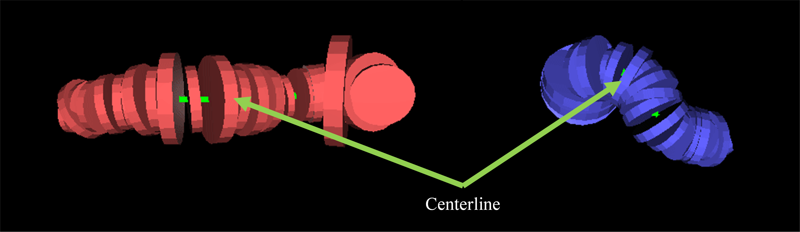
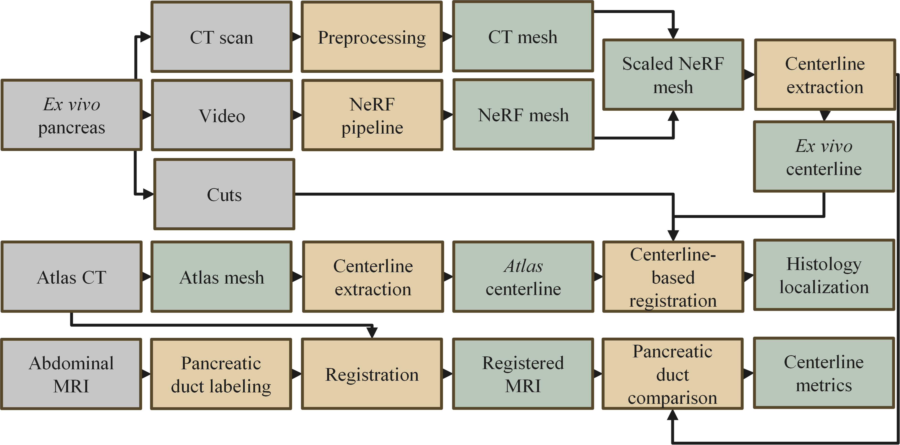

# Centerline-Guided Atlas Registration

Code for centerline-guided mesh registration of deformed ex vivo organ surfaces to 3D anatomical atlases while preserving local geometry.

## Overview

This repository contains the centerline-based registration component used in the manuscript:

**Globally Deformable, Locally Rigid Registration of Ex vivo Pancreas to a 3D Atlas Using a Centerline-Based Method**

The method was developed to map a deformed ex vivo pancreas surface to a 3D atlas using a globally deformable, locally rigid transformation. In the full study workflow, a specimen surface is reconstructed from smartphone video using a Neural Radiance Field (NeRF), scaled using ex vivo CT, and then transformed to atlas space through cylindrical coordinates defined by corresponding centerlines.

This repository focuses on the **registration and geometric evaluation** stages of that workflow. It does **not** implement wet-lab cut mapping directly. Instead, it registers the ex vivo pancreas surface to atlas space and provides a common anatomical frame that can support downstream mapping of cuts, blocks, and slides.

<p align="center">
  
</p>

## What this repository contains

This repository is intended to host the centerline registration stage of the workflow, including:
- centerline resampling and processing,
- vertex-to-centerline correspondence,
- cylindrical-coordinate transformation,
- mesh warping from specimen space to atlas space,
- radial distortion analysis utilities,
- simple YAML-driven runner scripts for the paper pipeline.

## Related repositories

The NeRF-based surface reconstruction pipeline used upstream in the study is available separately:

- https://github.com/MASILab/NerfOrganRecon

## Method summary

The core idea is to:
- extract a centerline from the ex vivo mesh,
- extract a centerline from the atlas mesh,
- establish a one-to-one correspondence between the two centerlines,
- represent each mesh vertex in a local coordinate system relative to the source centerline,
- transfer that representation to the atlas centerline.

This lets the specimen bend toward the atlas trajectory while preserving local radial geometry relative to the centerline.

<p align="center">
  
</p>

## Workflow summary

After NeRF scaling and rough alignment, centerlines are extracted externally using **VMTK within 3D Slicer**. The resulting source and atlas centerlines are saved as `.ply` point clouds and passed back to the Python registration script for resampling and centerline-guided mesh transformation.

The paper workflow is:
1. CT preprocessing and mesh generation
2. NeRF mesh scaling and rough alignment
3. **Manual step:** centerline extraction in VMTK / 3D Slicer
4. Centerline-guided registration to atlas space
5. Radial distortion and smoothing sensitivity analysis

<p align="center">
  
</p>

Given:
- an ex vivo specimen mesh,
- a target atlas mesh,
- a source centerline,
- a target centerline,

the method:

1. Resamples the specimen and atlas centerlines to matching point counts.
2. Assigns each specimen vertex to its nearest centerline sample.
3. Expresses each vertex in a local cylindrical frame:
   - radial distance `r`
   - angular position `theta`
   - tangent-direction offset `h`
4. Transfers `(r, theta, h)` to the corresponding atlas centerline frame.
5. Reconstructs the transformed vertex in atlas space.

This produces a deformation that is globally flexible but locally constrained by the centerline frame.

## Manuscript context

In the current study, the workflow was applied to a single ex vivo human pancreas specimen. The wet-lab sampling plan consisted of 25 tissue blocks and 100 sub-blocks, and the specimen centerline was resampled to 26 points to reflect the sequential dissection plan.

The registered geometry was then used to place specimen-derived locations into atlas space, providing the geometric basis for downstream localization of tissue blocks and histology.

<p align="center">
  
</p>

Geometric side effects were evaluated by measuring vertex-wise radial deviation before and after transformation. Moderate Laplacian smoothing (approximately 4–6 iterations) provided the best trade-off between surface stabilization and minimizing smoothing-induced shrinkage.

<p align="center">
  
</p>

## Inputs

Expected inputs include:
- specimen surface mesh,
- atlas surface mesh,
- specimen centerline,
- atlas centerline,
- optional smoothing parameters.

## Outputs

Expected outputs include:
- transformed specimen mesh in atlas space,
- transformed specimen centerline,
- centerline correspondence files,
- radial distortion measurements,
- summary tables and figures for quality control.

Downstream mapping of wet-lab cuts or histology can be built on top of these outputs, but is not the main purpose of this repository.

## Data acquisition used in the paper

For the feasibility study described in the manuscript, specimen video was acquired manually using the main rear camera of an iPhone 14 Pro at:
- 1920 × 1080 resolution
- 30 frames/s
- H.264 encoding
- ~180.8 s duration

The upstream NeRF mesh was scaled using ex vivo CT before centerline-based registration.

## Installation

```bash
uv venv --python 3.10
source .venv/bin/activate
uv pip install -e .
```

## How to run

```bash
python scripts/run_pipeline.py --config configs/pancreas_example.yaml --stage pre_vmtk
```

Extract the centerlines manually in VMTK / 3D Slicer and save them to the paths listed in the YAML config:

- `paths.nerf_centerline`
- `paths.atlas_centerline`

Then run registration and analysis:

```bash
python scripts/run_pipeline.py --config configs/pancreas_example.yaml --stage post_vmtk
python scripts/run_sensitivity_analysis.py --config configs/pancreas_example.yaml
```

You can also run stages separately:

```bash
python scripts/run_ct_preprocess.py --config configs/pancreas_example.yaml
python scripts/run_scale_align.py --config configs/pancreas_example.yaml
python scripts/run_registration.py --config configs/pancreas_example.yaml
python scripts/run_sensitivity_analysis.py --config configs/pancreas_example.yaml
```

## Repository structure

```text
centerline2atlas/
├── README.md
├── environment.yml
├── requirements.txt
├── configs/
├── scripts/
├── src/centerline2atlas/
└── figures/manuscript/
```

## Citation

If you use this code, please cite the associated manuscript:

```bibtex
@article{hucke2026centerline,
  title={Globally Deformable, Locally Rigid Registration of Ex vivo Pancreas to a 3D Atlas Using a Centerline-Based Method},
  author={Hucke, Andre T.S. and Kim, Michael E. and Remedios, Lucas W. and others},
  journal={TBD},
  year={2026}
}
```
